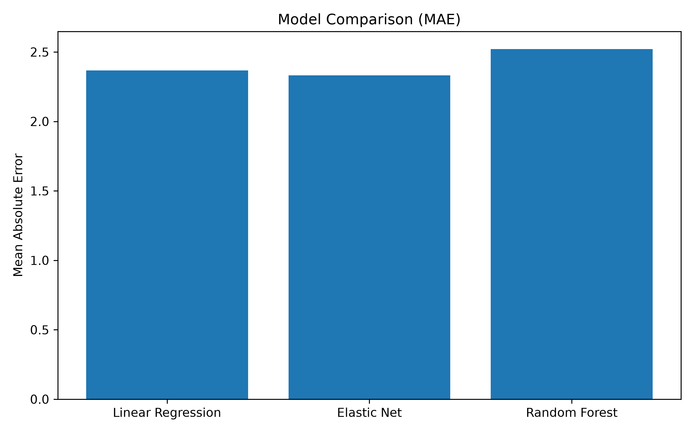
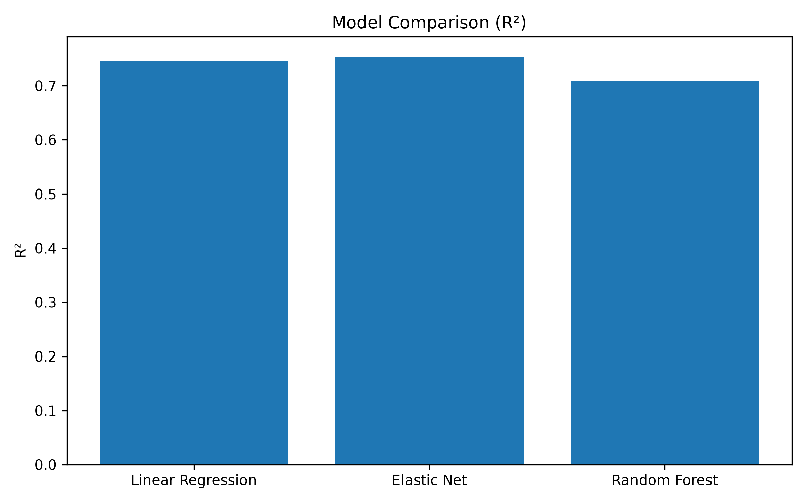
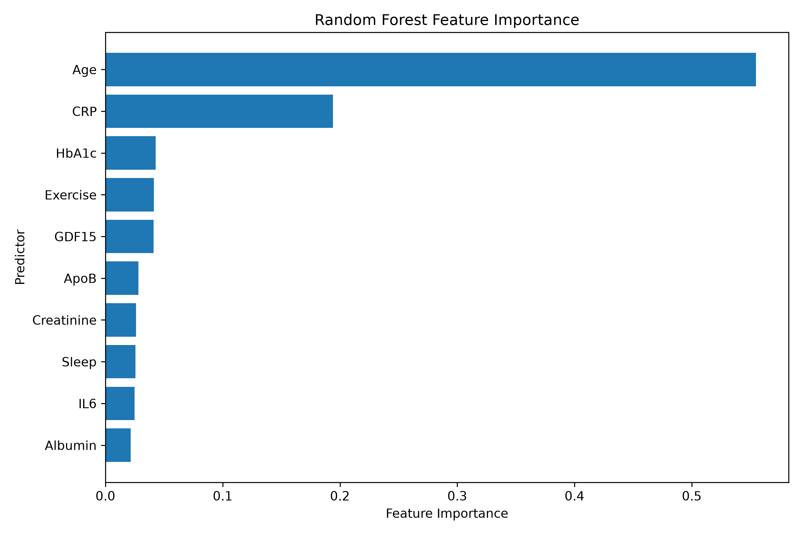
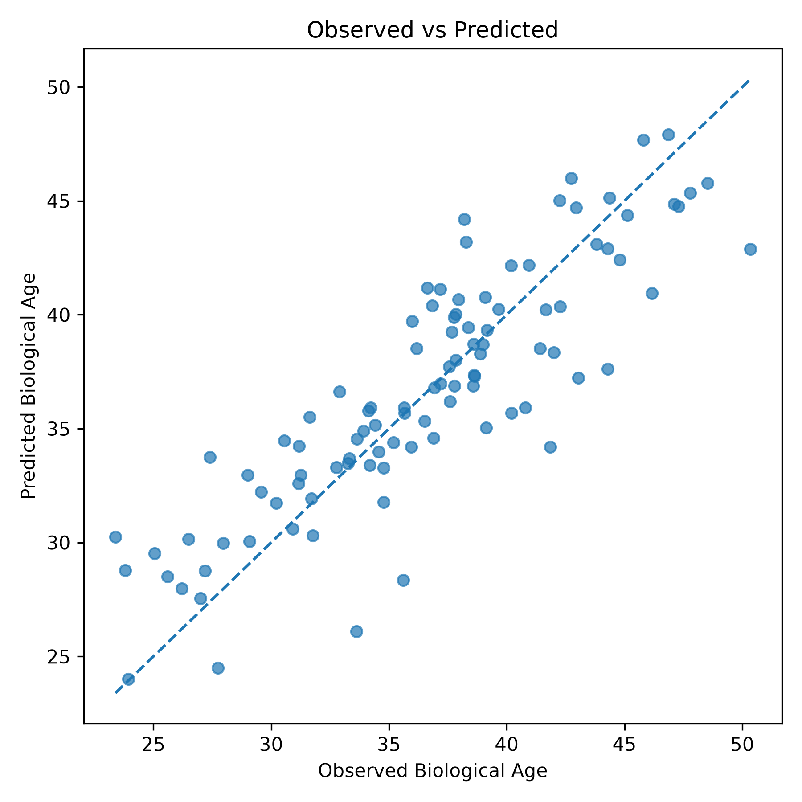

# Developing an Enhanced PhenoAge Model

A machine learning framework for improving the original **PhenoAge** biological age model by integrating additional biomarkers and lifestyle variables.

---

## Overview

This project proposes an enhanced version of the original **PhenoAge** algorithm developed by Levine et al. by incorporating biomarkers related to:

- Chronic inflammation
- Metabolic regulation
- Cardiovascular ageing
- Kidney function
- Cellular stress
- Lifestyle behaviours

The project demonstrates a complete workflow including:

- Literature review
- Biomarker selection
- Mathematical model
- Machine learning implementation
- Model evaluation
- Scientific report

---

## Project Structure

```
PhenoAge-Enhanced/
│
├── data/
├── docs/
├── figures/
├── notebooks/
├── outputs/
├── presentation/
├── references/
├── report/
│   └── report.pdf
│
├── requirements.txt
├── README.md
└── .gitignore
```

---

# Biomarkers

### Original PhenoAge

- Albumin
- Creatinine
- Glucose
- C-Reactive Protein (CRP)
- Lymphocyte Percentage
- Mean Cell Volume (MCV)
- Red Cell Distribution Width (RDW)
- Alkaline Phosphatase (ALP)
- White Blood Cell Count

### Proposed Additional Biomarkers

- IL-6
- TNF-α
- HbA1c
- ApoB
- Cystatin C
- GDF-15
- FGF-21
- NT-proBNP

---

# Machine Learning Models

The following regression models were evaluated:

- Linear Regression
- Elastic Net
- Random Forest

Evaluation metrics:

- Mean Absolute Error (MAE)
- R² Score
- Feature Importance

---

# Results

## Model Comparison (MAE)



---

## Model Comparison (R²)



---

## Random Forest Feature Importance



---

## Observed vs Predicted Biological Age



---

# Scientific Report

The complete report is available here:

```
report/report.pdf
```

It includes:

- Introduction
- Original PhenoAge biomarkers
- Proposed biomarker expansion
- Lifestyle integration
- Mathematical framework
- Machine learning implementation
- Results
- Discussion
- Future directions
- References

---

# Technologies

- Python
- Pandas
- NumPy
- Scikit-learn
- Matplotlib
- Jupyter Notebook

---

# References

- Levine ME et al. (2018)
- Horvath S. (2013)
- López-Otín C. et al. (2023)
- Kennedy BK et al. (2014)
- Franceschi C. et al. (2018)

---

# Author

**Agata Gabara**

2026
